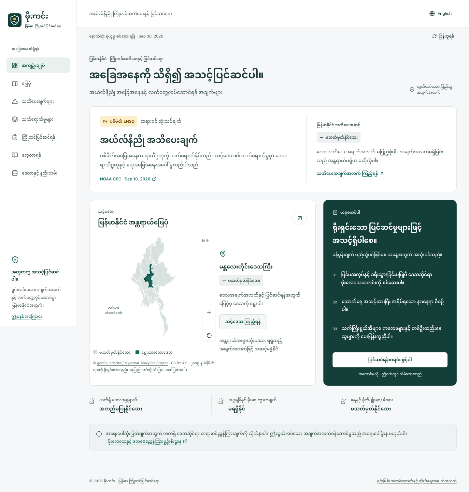

# မိုးကင်း · Mokinn

**Myanmar El Niño early warning and preparedness**, in Burmese first, with English available.

[Open the application](https://wai-999.github.io/El-Nino-Warning-System/)



## What is working

- National overview with a sourced NOAA ENSO assessment and distinct Myanmar warning status.
- Interactive, keyboard-accessible state/region map; selection, zoom, pan, severity and coverage layers, and local profiles.
- Validated regional bulletin pipeline, severity and location filters, expiry handling, history, source metadata, and confidence fields.
- Five sector guides; three explicitly conditional planning scenarios; practical heat-health advice.
- Eight locally saved preparedness checklists for households, heat, water, farming, livestock, schools, workplaces, and communities.
- Interactive ENSO education, transparent methodology, offline pages and checklists, installable PWA, self-hosted Burmese fonts, and no login.

**Important operational limit:** this is an independent preparedness resource, not an official emergency warning service. No reliable Myanmar regional alert or climate-observation feed is connected. Regional risk, anomalies, and local forecasts are therefore unavailable, not “normal.” The numerical risk engine is intentionally not enabled without locally validated thresholds. The application must not be represented as a fully operational official early-warning service. Current local authorities' instructions take priority.

## Repository audit and architecture

The requested GitHub repository was empty at implementation start. There was no existing code, framework, dataset, or deployment configuration to preserve. The result is a static React + TypeScript + Vite application. No application server or secret-bearing browser integrations are required.

```text
src/
  app/             shell, routing, language/context, failure boundary
  components/      accessible shared warning and source components
  features/        overview, local/map/warnings, impacts, prepare, learn, data
  data/            schemas, adapters, bilingual content, region identifiers
  map/             SVG geospatial rendering and winding adaptation
  risk/            source-derived warning selection, expiry and coverage rules
  services/        notification-ready contract, no sending integration
  styles/          design tokens, component styling, responsive and print rules
public/data/       validated source snapshot, licensed geometry and metadata
scripts/           source ingestion, validation, generated offline service worker
tests/             critical unit tests and browser/accessibility/offline tests
```

Hash routes work directly on GitHub Pages, including `#/map`, `#/warnings`, and `#/region/MM-04`. Scientific policy lives outside UI components. D3 renders lightweight geometry without remote tiles, WebGL, or a tracking map service. Unavailable datasets have explicit fallbacks.

The visual system uses deep green for navigation and selection, amber for the sourced Pacific advisory, generous spacing, readable Burmese typography, text/icon severity labels, and reduced-motion support. Selection green is not a low-risk classification.

## Development

Requires Node.js 24 and npm.

```sh
npm ci
npm run dev
# http://127.0.0.1:5173/El-Nino-Warning-System/
npm run test
npm run lint
npm run data:validate
npm run format:check
npm run build
npx playwright install chromium
npm run test:e2e
npm run preview
```

`npm run format` formats source and configuration. `npm run build` typechecks, creates the production bundle, and generates a content-versioned service worker. `npm run test:e2e` uses the production preview, not the development server, so offline checks exercise deployed behavior. HTML reports are in `playwright-report/` after a run.

No API keys or environment variables are required. `.env.example` documents `VITE_BASE_PATH`; its default is `/El-Nino-Warning-System/`. Override that public base for another host. This setting is read at build time. Never place secrets in variables prefixed `VITE_`.

## Sources and updating

Run `npm run data:refresh` to retrieve and validate the [NOAA CPC bulletin](https://www.cpc.ncep.noaa.gov/products/analysis_monitoring/enso_advisory/ensodisc.shtml), preserving source, publication date, and expiry. Unknown formats fail closed and retain the original dated bulletin. The app never converts global ENSO into a Myanmar alert.

The [methodology and operational guide](docs/METHODOLOGY.md) documents every threshold, manual regional ingestion, geometry provenance and license, warnings history, confidence, and offline semantics. Sources are also linked within the app: NOAA, WMO, WHO, FAO, geoBoundaries, and the official Myanmar DMH website.

Boundary source: [geoBoundaries / Myanmar Analytics Project](https://www.geoboundaries.org/api/current/gbOpen/MMR/ADM1/), CC BY 4.0. Adaptations: topology-preserving simplification and coordinate rounding. Reference year 2019, 14 polygons. **Nay Pyi Taw is selectable but is not a separate polygon in that source.** This is explicitly labelled; the map does not claim current survey precision. Local values and higher-resolution layers are not invented.

## Production deployment

GitHub Pages is configured for GitHub Actions. `.github/workflows/deploy.yml` validates formatting, lint, critical tests, data, the production build, and desktop/tablet/mobile browser tests before publishing `dist/`. On `main`, manual dispatch, and a daily 01:17 UTC schedule, it refreshes NOAA and commits the dated snapshot back to `main` using the repository token. The bot push does not trigger another workflow. Pull requests validate but neither refresh published data nor deploy.

The build job's repository write permission is limited to persisting the public data snapshot; the deployment job uses Pages write and OIDC permissions. If branch protection is enabled later, permit this data-update bot or replace its direct push with a reviewed update PR. Do not bypass branch protection.

To configure another fork: enable **Settings → Pages → Source: GitHub Actions**, set the correct base path, and permit GitHub Actions. Push to `main` or dispatch the deployment workflow. Failed data retrieval deploys the safe dated fallback; the final health job then marks the workflow failed so the owner can investigate. GitHub may disable scheduled workflows after prolonged repository inactivity; monitor Actions health and reenabling requirements. The displayed expiry still prevents a months-old ENSO bulletin being called current.

Live URL: **https://wai-999.github.io/El-Nino-Warning-System/**

## Validation and limitations

- Dedicated tests cover missing data, expired/future warnings, severity selection, invalid geography, source mismatch, duplicate IDs, confidence validation, NOAA parsing and date preservation, and geometry projection.
- Playwright covers desktop, tablet and mobile, both languages, all routes, map/list controls, checklists, unavailable/stale data, source failure, offline restarts, and automated WCAG checks.
- Automated accessibility checks are not a complete WCAG certification. Manual assistive-technology review and fluent Burmese editorial review are still recommended before an official public-safety rollout.
- Health guidance is general. Contact medical help for heatstroke signs; no unverified emergency telephone numbers are supplied.
- First-visit connectivity is needed to install offline resources. Browser storage can be unavailable or evicted; state is device-local.
- No personal accounts, analytics, or precise geolocation collection. Language, selected area, checklist progress, and a validated data snapshot are kept locally. GitHub hosting and external source links have their own request-logging policies.
- No live district/township warnings, climate anomalies, crop-specific forecast model, historical alert archive, or SMS/push/Telegram integration is claimed. The interfaces and safe empty states are ready for reviewed data and delivery integrations.

Future work should prioritise an authorised, monitored DMH/partner bulletin feed; current licensed boundaries including Nay Pyi Taw; validated regional climate data with baselines; locally calibrated warning thresholds; and professional Burmese and clinical review. Deployment success is not scientific or operational certification.
